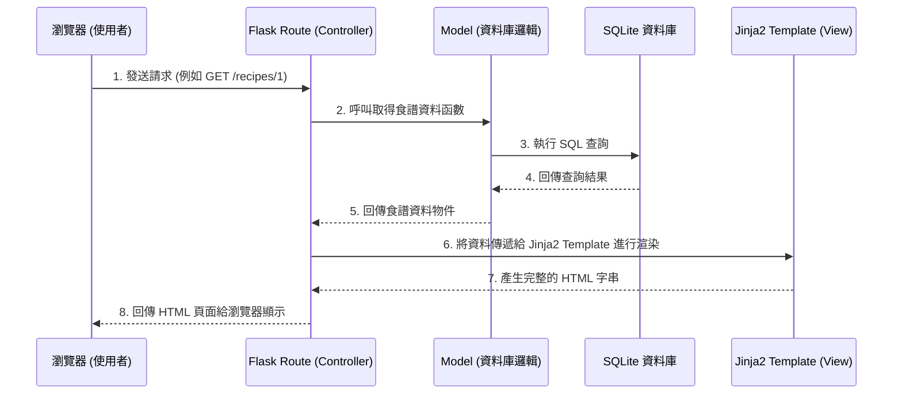

# 系統架構文件 (Architecture) - 食譜收藏夾系統

## 1. 技術架構說明

本專案採用輕量級的後端框架與模板引擎，不採用前後端分離，以達到快速開發與容易維護的目的。

- **後端框架：Python + Flask**
  - **原因**：Flask 是輕量級的微框架，適合用來快速建立中小型專案。它具備極高的彈性，能輕鬆擴充。
- **模板引擎：Jinja2**
  - **原因**：內建於 Flask，可直接在後端渲染 HTML 頁面並帶入動態資料。對於本專案這種偏重資料展示的個人工具非常合適。
- **資料庫：SQLite**
  - **原因**：無伺服器、檔案型資料庫，非常適合輕量級的單機或個人使用專案。可以透過內建的 `sqlite3` 或 SQLAlchemy 進行操作。
- **架構模式：MVC（Model-View-Controller）概念**
  - **Model（模型）**：負責與 SQLite 資料庫溝通，處理資料的讀取、寫入與業務邏輯（如：食譜 CRUD、標籤處理）。
  - **View（視圖）**：使用 Jinja2 模板，負責最終 HTML 的渲染與呈現，將後端傳來的食譜資料顯示給使用者。
  - **Controller（控制器）**：由 Flask 的 Route（路由）負責，接收使用者的瀏覽器請求，調用 Model 取得資料，再交由 View 渲染後回傳給瀏覽器。

## 2. 專案資料夾結構

以下為建議的 Flask 專案目錄結構：

```text
web_app_development/
├── app.py                # 應用程式入口點，負責啟動 Flask 伺服器
├── config.py             # 系統設定檔（如資料庫連線字串、密鑰等）
├── app/                  # 核心應用程式目錄
│   ├── __init__.py       # 初始化 Flask 實例與載入設定
│   ├── models/           # 模型層 (Model)：存放與資料庫互動的程式碼
│   │   └── recipe.py     # 食譜與食材的資料庫操作邏輯
│   ├── routes/           # 路由層 (Controller)：定義 URL 與對應的處理函數
│   │   └── main.py       # 主要的路由邏輯 (查詢、新增、刪除等 API)
│   ├── templates/        # 模板層 (View)：存放所有的 HTML Jinja2 檔案
│   │   ├── base.html     # 共用的網頁骨架與選單
│   │   ├── index.html    # 首頁 / 食譜列表頁
│   │   ├── recipe.html   # 單一食譜詳細資訊頁
│   │   └── add.html      # 新增/編輯食譜頁面
│   └── static/           # 靜態資源：存放 CSS, JS 與圖片
│       ├── css/
│       │   └── style.css
│       └── js/
│           └── main.js
├── instance/             # 存放執行期間產生的檔案（不會進 Git）
│   └── database.db       # SQLite 資料庫檔案
├── docs/                 # 專案說明文件
│   ├── PRD.md            # 產品需求文件
│   └── ARCHITECTURE.md   # 系統架構文件
└── requirements.txt      # Python 依賴套件清單
```

## 3. 元件關係圖

以下展示使用者如何透過瀏覽器與系統互動的流程：



## 4. 關鍵設計決策

1. **採用單體式架構 (Monolithic) 與後端渲染**
   - **原因**：為了提升開發效率並滿足個人專案的需求，不使用 React 或 Vue 等前端框架進行前後端分離，而是讓 Flask 直接處理路由與頁面渲染，大幅降低架構複雜度。
2. **SQLite 作為唯一儲存媒介**
   - **原因**：考量到此系統為個人使用的「收藏夾」，資料量與併發存取率極低。SQLite 的檔案型特性方便備份（只需複製單一檔案），無需維護獨立的資料庫伺服器。
3. **功能模組化拆分 (models/, routes/, templates/)**
   - **原因**：即使是小專案，也應避免將所有程式碼塞在單一 `app.py` 中。將資料庫操作與路由分開放置，未來若要擴充功能（例如：食材採買清單產生器），能更輕易地加入新模組，提高程式碼的可讀性與可維護性。
4. **設立獨立的 instance/ 資料夾**
   - **原因**：將 `database.db` 放在 `instance/` 資料夾內，可配合 `.gitignore` 避免不小心將個人私有的食譜資料推送到公開的 GitHub 儲存庫。
