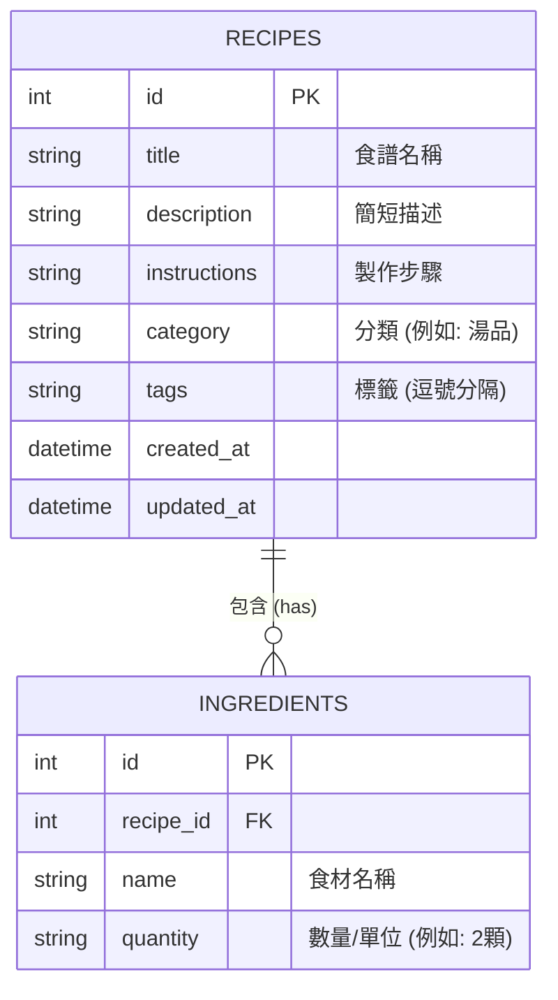

# 資料庫設計 (DB Design) - 食譜收藏夾系統

本文件根據功能需求與流程圖，定義系統的 SQLite 資料庫結構、實體關係與對應的 Python Model 實作。

## 1. ER 圖（實體關係圖）

## 2. 資料表詳細說明

### 2.1 `recipes` (食譜表)
儲存食譜的主要資訊。
- `id`: INTEGER, Primary Key, 自動遞增。
- `title`: TEXT, 必填。食譜的名稱。
- `description`: TEXT, 選填。對這道菜的簡單介紹。
- `instructions`: TEXT, 必填。詳細的料理步驟。
- `category`: TEXT, 選填。主分類（如：主食、配菜、湯品）。
- `tags`: TEXT, 選填。次要標籤，以逗號分隔（如：快速、低脂）。
- `created_at`: DATETIME, 自動帶入目前時間。
- `updated_at`: DATETIME, 每次更新時修改。

### 2.2 `ingredients` (食材表)
儲存各食譜所需的食材清單。獨立成表有助於未來開發「總採買清單」功能。
- `id`: INTEGER, Primary Key, 自動遞增。
- `recipe_id`: INTEGER, 必填。Foreign Key 對應 `recipes.id`，並設定 `ON DELETE CASCADE`。
- `name`: TEXT, 必填。食材名稱。
- `quantity`: TEXT, 選填。所需數量與單位（如：200g, 1大匙）。

## 3. SQL 建表語法
完整的 SQLite 建表語法已儲存於 `database/schema.sql` 檔案中，包含了 `recipes` 與 `ingredients` 資料表，以及 Foreign Key 關聯。

## 4. Python Model 程式碼
考量到系統輕量化與無過多外部依賴的原則，直接使用 Python 內建的 `sqlite3` 模組實作。
所有的資料庫操作封裝在 `app/models/recipe.py` 中，並提供完整的 CRUD（Create, Read, Update, Delete）方法。
