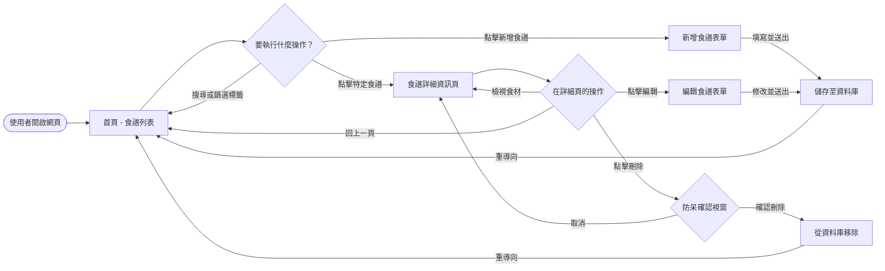
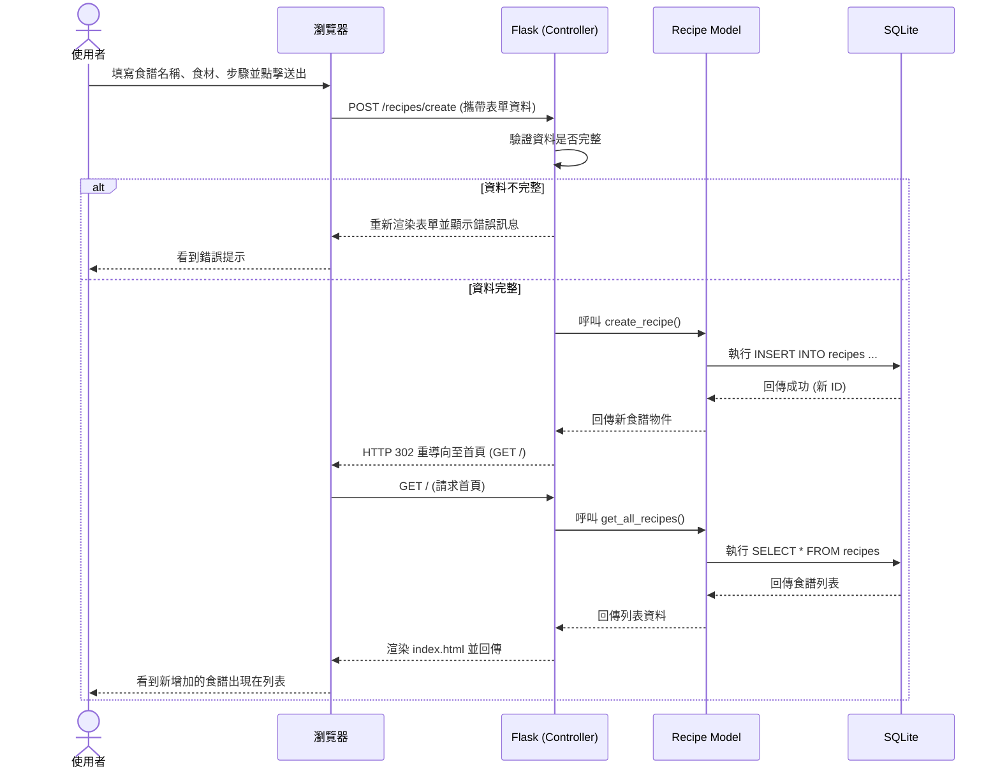

# 流程圖 (Flowchart) - 食譜收藏夾系統

本文件根據 PRD 與架構設計，描繪使用者的操作路徑以及系統內部的資料流動。

## 1. 使用者流程圖 (User Flow)

此圖展示使用者從進入網站開始，能夠進行的主要操作路徑，包含瀏覽、新增、編輯與刪除食譜。

## 2. 系統序列圖 (Sequence Diagram)

此圖以「使用者新增食譜」為例，描述從使用者送出表單到資料庫完成儲存，並回傳畫面的完整系統運作流程。

## 3. 功能清單與 API 對照表

以下整理了系統主要功能對應的 URL 路徑與 HTTP 方法，為後續的路由設計提供基礎。

| 功能名稱 | HTTP 方法 | URL 路徑 | 說明 |
| --- | --- | --- | --- |
| 檢視食譜列表 | GET | `/` 或 `/recipes` | 首頁，顯示所有食譜，支援關鍵字與標籤篩選。 |
| 新增食譜頁面 | GET | `/recipes/create` | 顯示新增食譜的 HTML 表單。 |
| 處理新增食譜 | POST | `/recipes/create` | 接收表單資料並寫入資料庫。 |
| 檢視單一食譜 | GET | `/recipes/<id>` | 顯示特定食譜的詳細步驟與食材清單。 |
| 編輯食譜頁面 | GET | `/recipes/<id>/edit` | 顯示載入現有資料的編輯表單。 |
| 處理編輯食譜 | POST | `/recipes/<id>/edit` | 接收修改後的資料並更新至資料庫。 |
| 刪除食譜 | POST | `/recipes/<id>/delete`| 接收刪除請求並從資料庫移除（為安全考量，使用 POST 代替 GET）。 |
